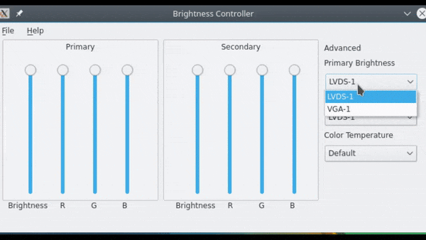
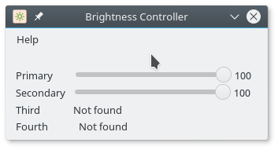

# Brightness Controller

This is version 2.3.4 of Brightness Controller, ported to Python 3 and QtPy. It supports an arbitrary number of displays!

If you like this, do not forget to give us a Star!  [](https://github.com/lordamit/brightness/stargazers) People already did!



## Installation via package managers

### Ubuntu and derivatives
Thanks to package maintainer @apandada1, we have [PPA](https://launchpad.net/~apandada1/+archive/ubuntu/brightness-controller/) repository For Ubuntu and likewise users:

```bash
sudo add-apt-repository ppa:apandada1/brightness-controller
sudo apt update
sudo apt install brightness-controller
```
### Arch and derivatives
Thanks to @yochananmarqos, a package for Arch and derivatives is available in the [AUR](https://aur.archlinux.org/packages/brightness-controller-git).

```bash
yay -S brightness-controller-git
```

## Manual Installation

First, install `QtPy`.

```bash
sudo apt install python3-qtpy
```

Sometimes it is not enough to install and integrate `QtPy`, so you might also try installing `QtPy` using `pip3`.

```bash
pip3 install qtpy
```

`QtPy` is a wrapper that works by using `PyQt` or `PySide`.

**It needs either of these to work**, and some operating systems come with either of these preinstalled, and some do not.

If your system does not have either of these, you may need to install either `PySide` or `PyQt`. For example, you may have to execute the following:

```bash
pip install PySide2
```

Please check [Requirements](#requirements) section for missing dependencies. We prefer using `--user` while installing `QtPy`  (and its other dependencies) using `pip`. Installing it in virtual environment may not work as intended.

Next, download the latest zip file from [here](https://github.com/lordamit/Brightness/archive/master.zip).

Extract it and open a terminal. Change directory to the `Brightness` folder. Next type this command:

```bash
python3 src/init.py
```

Achean also created a detailed tutorial on how to install it in Debian based on his experience. You can find it [here](https://github.com/LordAmit/Brightness/issues/98#event-1218811468).

## Features

The following features are implemented:

1. Brightness Control
1. Saving color profile
1. Loading color profile

We are working on the following features and plan to release these through version 3:

1. Rewriting GUI to integrate both Brightness Controller simple and normal
2. Auto-loading of color and brightness settings based on profile
3. Checking for update

Brightness Controller changes Red, Green and Blue color ratios  in the screen through color profile at software level using `xrandr`. 

We work on this in our spare time, so can not really promise when the v3 will be released. The current version available is stable and should work as intended.

## Requirements

There are several requirements:

1. python3
2. python3-qtpy
3. xrandr support in your system

`python3-qtpy` is a wrapper around Qt for Python. You will need either PyQt5, PyQt4, PySide2 or PySide installed in your system.

## Bugs

Please test v2.3. Reporting bugs is appreciated.

## Can I have just brightness sliders - For Controlling Four displays at the same time?

We got you covered! Try version 1.2.8/simpler version of Brightness Controller.



To install, simply do this:

```bash
sudo add-apt-repository ppa:apandada1/brightness-controller
sudo apt-get update
sudo apt-get install brightness-controller-simple
```

Further details are available [here](http://lordamit.github.io/Brightness/)
Please note that the simple version may not work properly in newer versions of Linux. Unfortunately we can not provide any more updates to the simple version.
